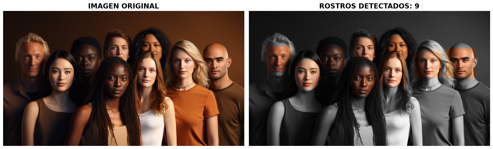
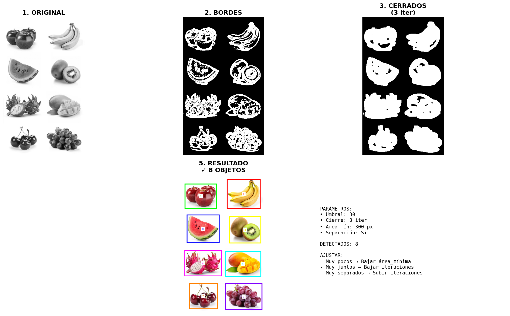

# Proyectos del curso de Procesamiento Digital de Imágenes

## [Detector de rostros](https://github.com/gabhu-dev/pdi-projects/tree/main/detector-de-rostros)
Este proyecto implementa un sistema de detección y conteo automático de objetos en una imagen utilizando procesamiento digital de imágenes en Python, sin depender de librerías avanzadas como OpenCV para la segmentación principal.

## [Contador de objetos](https://github.com/gabhu-dev/pdi-projects/tree/main/contador-de-objetos)
Este proyecto desarrolla un contador automático de objetos a partir de una imagen usando técnicas clásicas de procesamiento digital de imágenes en Python.

El sistema está diseñado para contar objetos (como frutas) incluso cuando:

- Están fragmentados por bordes incompletos.
- Están muy cercanos entre sí.
- Existen ruidos o irregularidades en la imagen.

